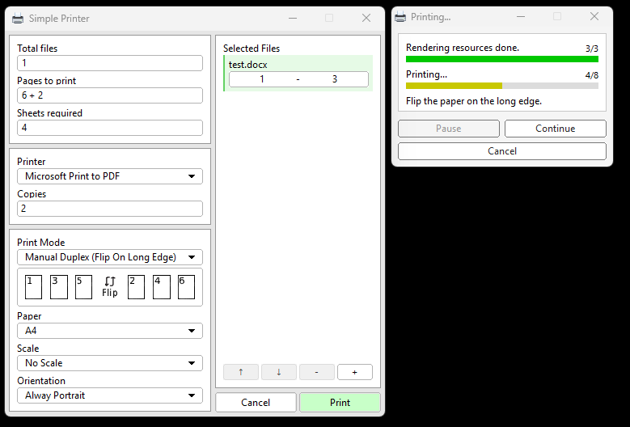

# 🖨️ Simple Printer

> Print files in **one right-click** — fast, simple, no nonsense.

---

## ✨ Features

* ⚡ **Instant printing** with last-used settings (no dialog spam)
* 🖱️ **Right-click integration** in File Explorer
* 🔁 Supports:

  * Simplex
  * Duplex
  * Manual Duplex (Long Edge / Short Edge)
* 📄 Handles:

  * Multiple copies
  * Page batching
  * Auto add blank page (for odd duplex)
* 🧠 Uses **native WinAPI** → no heavy middle layer

---

## 🧩 Supported Files

* 📄 `.pdf`
* 📝 `.docx` *(requires Microsoft Word)*
* 🖼️ Images

---

## ⚙️ How It Works

### 🖥️ UI Mode

1. Open app
2. Select file
3. Configure settings
4. Print

---

### 🖱️ Right-click Mode

Right-click any supported file:

```
Print with SimplePrinter
```

👉 Automatically prints using:

* Last used settings
* Or default settings (first run)

---

## 🔁 Manual Duplex Logic

### 📘 Flip on Long Edge

```
1, 3, 5  → print
flip paper
2, 4, 6  → print
```

---

### 📗 Flip on Short Edge

```
1, 3, 5  → print
flip paper
6, 4, 2  → print (reversed)
```

---

### 📌 Notes

* Automatically adds **blank page** if total pages is odd
* Supports **multiple copies**

---

## 🖼️ Screenshots



---

## 📦 Installation

Download from **Releases**:

```
SimplePrinter-Setup.exe
```

Installer will:

* 📁 Create app directory
* 🔗 Add desktop shortcut
* 🖱️ Add right-click context menu

---

## 🛠️ Build

### Requirements

* Windows
* C++
* CMake
* MSYS2 (UCRT64)

### Build
Run
```bash
.\build.bat
```

---

## ⚠️ Limitations

* ❌ Windows only
* ❌ Only supports: PDF / DOCX / Images
* ❌ `.docx` requires Microsoft Word
* ❌ Cannot run multiple print jobs at the same time
* ❌ No preview / notification system

---

## 🎯 Why Simple Printer?

* Faster than default Windows print flow
* No popup hell
* Manual Duplex done right
* Built for **real usage**, not demo

---

